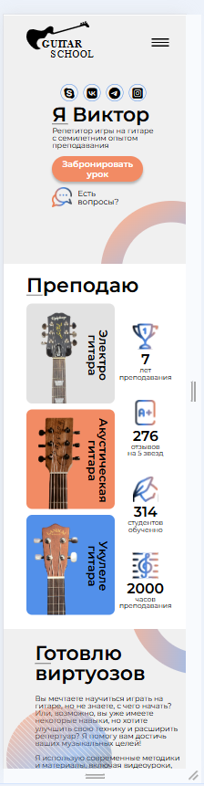
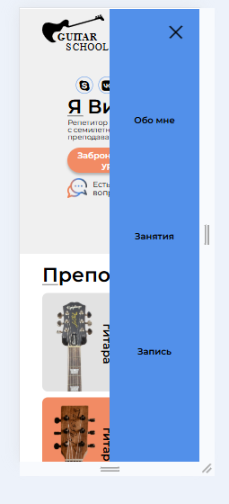

#   Guitar Instructor Portfolio Website - Learning Project 

## Project Overview
Professional portfolio website for a guitar instructor, showcasing teaching methodology, experience.

## Tech Stack
- **Frontend**: HTML5, CSS3 with SASS
- **Interactivity**: Vanilla JavaScript
- **Methodologies**: BEM for CSS architecture

## Key Features

### Responsive Presentation
- **Layout**: Flexbox-based design
- **Adaptability**: 
  - Mobile-optimized (under 768px)
  - Tablet-friendly (768-1024px)
  - Desktop experience (1024px+)

  
    

### Interactive Elements
1. **Lesson Inquiry Modal**:

   

2. **Mobile Navigation**:
   - Compact hamburger menu
   - Smooth animations

   

